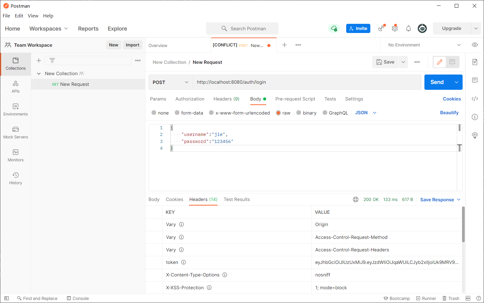
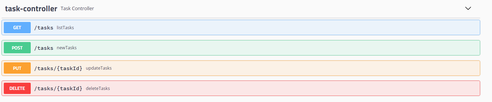
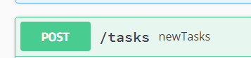

#参考学习

https://github.com/echisan/springboot-jwt-demo/blob/master/blog_content.md

主要根据上方链接文档编写 技术栈改为mybatis-plus

项目主要是简单实现SpringSecurity整合Jwt的Demo 逻辑比较简单
#项目使用
运行sql文件 
使用PostMan测试登录功能(默认用户名密码 jie 123456)

复制消息头的token

访问swagger
http://localhost:8080/swagger-_ui_.html
测试带token不带token访问接口结果

该接口只允许管理员访问 
修改数据库用户角色为ROLE_ADMIN
使用PostMan重新获得token测试即可访问

多权限之间用逗号(,)隔开

